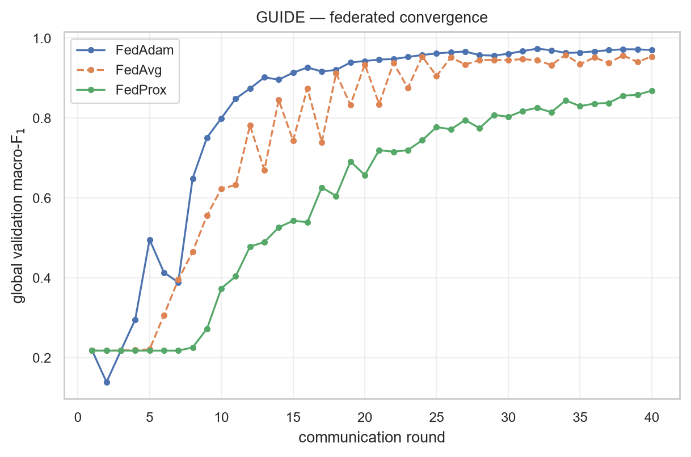
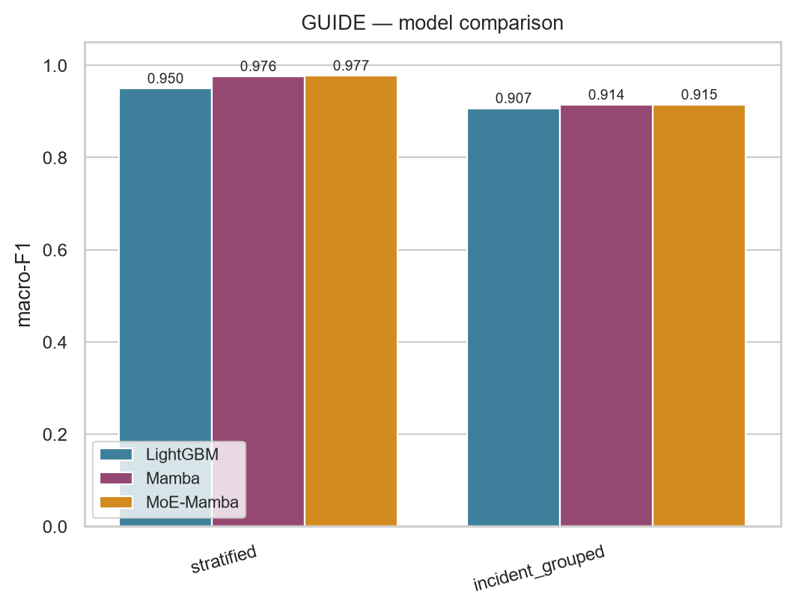
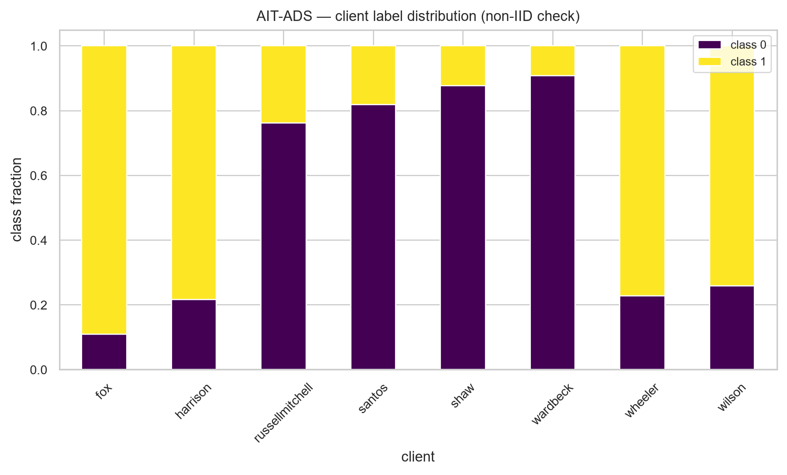
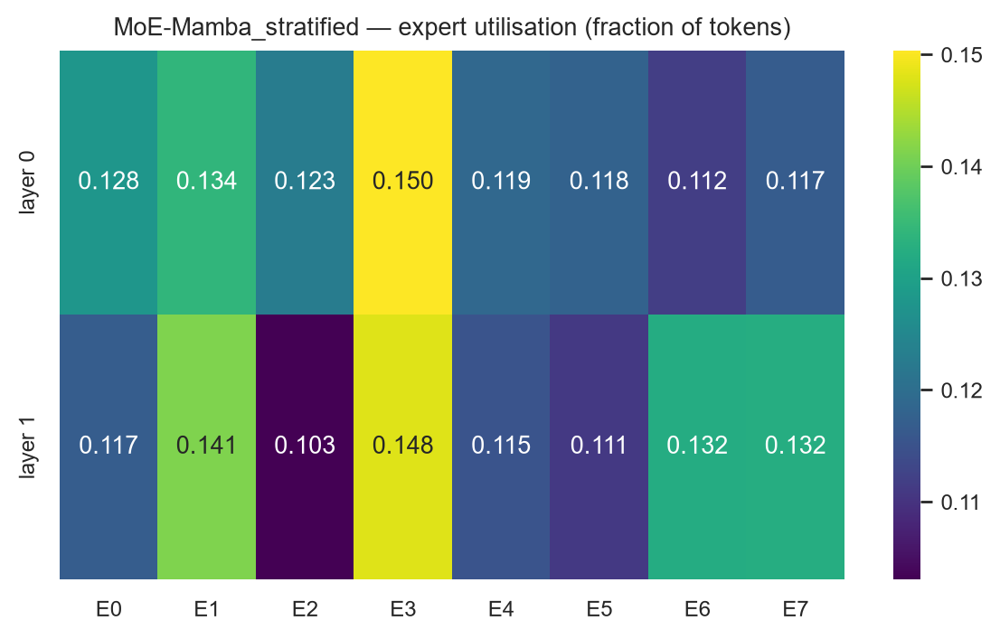
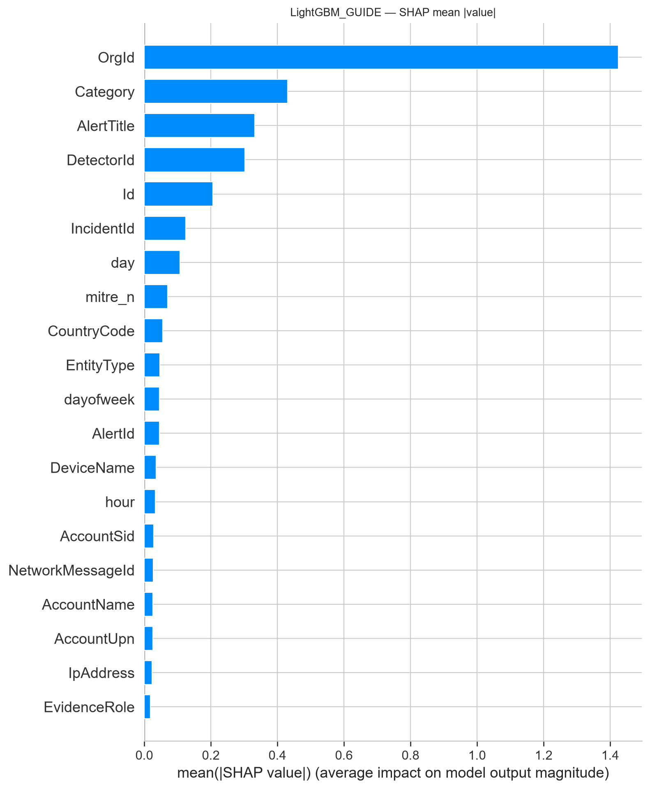

# MoE-Mamba for SOC Alert Triage

Sparse Mixture-of-Experts over selective state-space (Mamba) models for security
alert triage, evaluated **centrally** and under **federated learning** on three
corpora: Microsoft GUIDE, AIT-ADS and Splunk BOTSv3.

Each alert is represented as a short sequence of *field tokens* (one token per
column), encoded by a bidirectional selective SSM, with the dense feed-forward
sub-layer replaced by a token-level top-k sparse MoE.

---

## Headline results

| Corpus | Model | macro-F1 | Accuracy |
|---|---|---:|---:|
| GUIDE | MoE-Mamba (centralised) | **0.9773** | 0.9794 |
| GUIDE | Mamba (centralised) | 0.9760 | 0.9783 |
| GUIDE | LightGBM (centralised) | 0.9495 | 0.9530 |
| GUIDE | **FedAdam (federated, 10 orgs)** | **0.9703** | 0.9717 |
| AIT-ADS | MoE-Mamba (centralised) | 0.9914 | 0.9914 |
| AIT-ADS | **FedAdam (federated, 8 scenarios)** | **0.9897** | 0.9897 |
| BOTSv3 | MoE-Mamba (centralised) | 0.8093 | 0.9865 |
| BOTSv3 | **FedAdam (federated, 5 hosts)** | **0.8412** | 0.9778 |

**Federated learning recovers 99.3% of centralised performance on GUIDE**
(0.9703 vs 0.9773) without any raw alert leaving its organisation.

### Federated aggregation strategies

| Corpus | FedAdam | FedAvg | FedProx | SCAFFOLD |
|---|---:|---:|---:|---:|
| GUIDE (10 orgs, 40 rounds) | **0.9703** | 0.9580 | 0.8715 | n/a |
| AIT-ADS (8 scenarios) | **0.9897** | 0.9811 | 0.9811 | 0.9765 |
| BOTSv3 (5 hosts) | **0.8412** | 0.8013 | 0.7744 | 0.8276 |

FedAdam (server-side adaptive aggregation) beats the FedAvg baseline on all
three corpora. FedProx never helped. SCAFFOLD is not applicable on GUIDE — its
control variates assume SGD-sized local steps, but the 111M-parameter embedding
model only trains under AdamW.



*Global validation macro-F1 per communication round, GUIDE. FedAvg dashed.*



*Centralised macro-F1 by model and protocol on GUIDE.*

---

## Datasets

The corpora are **not redistributed here** — download them from the sources
below and set the paths at the top of each loader in `src/data/`.

### 1. GUIDE — Microsoft Security Incident Prediction

Real Microsoft Defender SOC alert evidence, graded by analysts.

| | |
|---|---|
| Source | https://www.kaggle.com/datasets/Microsoft/microsoft-security-incident-prediction |
| Paper | Freitas et al., *AI-Driven Guided Response for SOCs with Microsoft Copilot for Security*, arXiv:2407.09017 |
| Full corpus | 13M+ evidence rows, 1M+ incidents, 6,100+ organisations, 441 MITRE ATT&CK techniques |
| Used here | 1,492,081 rows |
| Unit | evidence row |
| Label | `IncidentGrade` ∈ {TruePositive, BenignPositive, FalsePositive} |
| Balance | 43.4% BP / 35.1% TP / 21.5% FP |
| Fields used | 38 (33 categorical + 5 derived numeric) |
| Grouping entity | `OrgId` \| `IncidentId` |

Loader: `src/data/guide_full.py`

**Preprocessing.** Drop rows with missing/invalid `IncidentGrade`; drop columns
>50% missing (9 columns on this slice); remove label and non-feature columns
(`Timestamp`, `MitreTechniques`, `Usage`); derive `hour`, `day`, `dayofweek`,
`month`, `mitre_n`; keep all remaining columns as categorical **including the
identifiers** `Id`, `OrgId`, `IncidentId`, `AlertId` (this matches the published
protocol — see the leakage note below); factorise categoricals with a `__NA__`
sentinel.

### 2. AIT-ADS — AIT Alert Data Set

Alerts from Wazuh, Suricata and AMiner over synthetic-but-realistic multi-host
testbed logs, across eight independently generated attack scenarios.

| | |
|---|---|
| Source | https://zenodo.org/record/8263181 |
| Scripts | https://github.com/ait-aecid/alert-data-set |
| Paper | Landauer, Skopik & Wurzenberger, *Introducing a New Alert Data Set for Multi-Step Attack Analysis*, CSET 2024 |
| Used here | 272,560 alerts |
| Unit | alert |
| Label | attack vs benign (49.7% / 50.3%) |
| Fields used | 12 (8 categorical + 4 numeric) |
| Scenarios | fox, harrison, russellmitchell, santos, shaw, wardbeck, wheeler, wilson |

Loader: `src/data/ait.py`

**Fields.** Categorical: `detector`, `signature`, `rule_group`, `decoder`,
`agent`, `location`, `component_type`, `suri_category`. Numeric: `severity`,
`n_paths`, `log_lines`, `firedtimes`.

### 3. BOTSv3 — Splunk Boss of the SOC v3

Real adversary-emulation telemetry captured in Splunk.

| | |
|---|---|
| Source | https://github.com/splunk/botsv3 |
| Used here | 1,944,093 events |
| Unit | event |
| Label | malicious vs benign — **1.16%** positive (22,469 events) |
| Fields used | 26 behavioural fields |
| Sourcetypes | 107 |
| Hosts | 30 |

Loader: `src/data/bots_rich.py`

**Extraction.** Events were exported from the Splunk buckets with
`splunk cmd exporttool` inside a container (17 buckets → 1.6 GB CSV).

**Preprocessing — this one matters.** Each event is parsed per sourcetype into a
common schema of 26 *behavioural* fields (protocol, action, event code, DNS
query type / reply code, HTTP method / status, direction, application, OS event
type, ports, byte and packet counters, duration, event count, raw length, token
and digit counts, port-class indicators). **All identifiers and timestamps are
excluded** — no IPs, domains, hashes, user or host names, no wall-clock time —
and labels come from event *content* matching indicators of compromise, not from
host membership.

A first version that labelled by hostname while also using hostname as a feature
scored 99.98% accuracy. That is circular, and the current pipeline exists to
avoid it. Sentinel masking was rejected too: replacing an identifier with a
constant makes `value == <MASKED>` itself a perfect predictor.

---

## Read this before quoting any number

**GUIDE scores depend on identifier fields.** With `Id`/`OrgId`/`IncidentId`/
`AlertId` retained, MoE-Mamba reaches ~0.977. With a semantic-only feature set
it reaches ~0.79. Both protocols appear in the literature; they are not
comparable. We use the identifier-inclusive protocol to match published practice
and report the identifier-free protocol separately.

In the **federated** setting this is sharper. With 5 organisation-clients,
identifiers kept and random within-client splits, FedAdam scores 0.9837 — but
the trivial rule "predict each organisation's dominant grade" scores 0.988
accuracy on the same split, because each client is 95–99.9% single-class and
`OrgId` is an input feature. Removing the identifiers and splitting by
`IncidentId` drops the same configuration to 0.6704, a difference of **0.3133
macro-F1**. Both are in `results/`.

**BOTSv3 stratified scores are not trustworthy.** All 22,469 positives come from
~6 indicator entities, so a row-level random split puts packets from the same
flow on both sides. `bytes_in` alone scores 0.7943 macro-F1 against 0.9902 for a
random forest on all 26 fields. Held-out-host performance drops to 0.86–0.90,
and on one host every model collapses to macro-F1 0.4840 with MCC exactly 0.

**BOTSv3 accuracy is misleading.** At a 1.16% positive rate, always predicting
"benign" scores 0.9884 accuracy and 0.4971 macro-F1. Use macro-F1.

**All results are single-seed.** The MoE-vs-dense differences (|Δ| ≤ 0.0014) are
smaller than the variation we measured from changing only the LR schedule
(0.0012), so we make no significance claim there.



*AIT-ADS federated clients are genuinely non-IID: `fox` is 10.9% benign,
`wardbeck` is 90.8%.*

---

## Method

**Field-token representation.** A record with `n_c` categorical and `n_n`
numeric fields becomes a length `L = n_c + n_n` token sequence. Categorical
field *j* is embedded from a shared table with per-field offsets; numeric fields
are standardised and linearly projected. A learned field-position embedding is
added.

**Selective SSM.** Each block applies a depthwise causal convolution, a SiLU
gate, and a selective scan with input-dependent `Δ`, `B`, `C`; `A` is
parameterised in log-space and `ΔA` clamped to `[-3, 0]`. Field sequences have
no causal direction, so the block is bidirectional.

**Sparse MoE.** The dense FFN is replaced by token-level top-k routing over E
experts with Switch-style load balancing. Routing is per *token*, so different
fields of the same alert can use different experts. The auxiliary loss minimum
under uniform routing is 1.0, which makes it directly readable as a diagnostic.

Default config: `d_model=64`, `n_layers=2`, `d_state=4`, `expand=1`,
`dropout=0.1`, `E=8`, `top_k=2`, `aux_weight=0.01`, batch 1024, AdamW +
OneCycle at `lr=3e-3`, seed 42.



*Expert utilisation on GUIDE. Routing stayed balanced (auxiliary loss converged
to 1.0000) — the mechanism worked; it just did not improve accuracy.*

**On the MoE result, honestly:** across six centralised splits the mean change
in macro-F1 from adding sparse routing is **−0.00005** (range −0.0014 to
+0.0013). Sparse routing did **not** improve accuracy on these corpora. What it
did deliver is parameter efficiency — on AIT-ADS and BOTSv3 it matches dense
accuracy within 0.0014 using 34.6% and 38.9% of parameters per token — and the
router map, an intrinsic interpretability artefact a dense model cannot produce.

---

## Explainability

SHAP, LIME and permutation importance for all three corpora (`src/exp/xai_run.py`),
computed on identical rows/features/splits to the results tables.



*SHAP global importance on GUIDE — dominated by identifier-derived fields, the
attribution-level signature of the leakage described above.*

These are computed on the **tree baseline**, not on MoE-Mamba: TreeExplainer
does not apply to it and KernelExplainer over a 111M-parameter model is not
tractable. Neural interpretability is covered intrinsically by the router maps
and expert-utilisation heatmaps.

---

## Repository layout

```
src/common/   mamba.py         pure-PyTorch selective scan (S6) + BiMamba
              moe_mamba.py     SparseMoE + MoEMambaTab
              mamba_tab.py     dense MambaTab baseline
              evaluate.py      metrics, plots, SHAP/LIME/permutation
src/data/     guide_full.py    GUIDE loader (38 fields, identifiers included)
              ait.py           AIT-ADS loader
              bots_rich.py     BOTSv3 per-sourcetype behavioural parser
src/exp/      moe_run.py       centralised: LightGBM vs Mamba vs MoE-Mamba
              fed_run.py       federated: FedAvg/FedProx/FedAdam/SCAFFOLD
              xai_run.py       SHAP / LIME / permutation importance
              fed_retry.py     retry supervisor (resumes across crashes)
              fed_chain.py     run datasets sequentially
src/fed/      fed_core.py      aggregation strategies
results/      every metric behind the tables (JSON + CSV)
figures/      the five figures used in this README
```

## Usage

```bash
pip install torch numpy pandas scikit-learn lightgbm matplotlib seaborn shap lime

# edit the dataset paths at the top of src/data/*.py first

python src/exp/moe_run.py guide     # centralised, one corpus per call
python src/exp/moe_run.py ait
python src/exp/moe_run.py bots

python src/exp/fed_run.py guide     # federated
python src/exp/fed_run.py ait
python src/exp/fed_run.py bots

python src/exp/xai_run.py           # SHAP / LIME / permutation, all corpora
```

`fed_run.py` resumes per algorithm and checkpoints every 5 rounds, so an
interrupted run continues rather than restarting.

Key switches at the top of `fed_run.py`:

```python
ROUNDS = 40                    # 15 badly undertrains; +0.0786 macro-F1 from 15 -> 40
FED_DROP_IDENTIFIERS = False   # True for the identifier-free protocol
FED_GROUPED_SPLIT    = False   # True to split within clients by IncidentId
MIN_CLIENT_PER_CLASS = 20      # excludes label-degenerate mega-clients
WEIGHT_CAP = 20.0              # caps the local class-weight ratio
```

## Citation

Paper under preparation. Please cite the dataset sources above when using the
loaders.

## License

Code released under the MIT License. The datasets are governed by their own
licenses — see the sources listed above.
